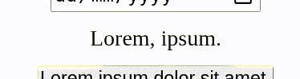
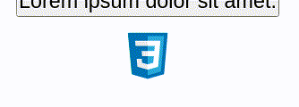

## ipad-cursor-js

An iPadOS based cursor for the browser

Demo [https://ipad-cursor-js.netlify.app/](https://ipad-cursor-js.netlify.app/)

#### Features

- Circular cursor
- Text cursor for text content
- _Drag_ cursor which wiggles an elements when hovering
- _Fill_ cursor which snaps to and wraps an element, also wiggles it

#### Installation

```bash
npm install ipad-cursor-js
```

Or add this

```html
<script
  type="text/javascript"
  src="https://cdn.jsdelivr.net/npm/ipad-cursor-js@1.0.1/index.js"
></script>
```

#### Usage

**Creating the cursor**

Nothing needs to be done to create a cursor, it is attached to the DOM automatically.

However to customise the cursor, you can add a `<div>` with id `cursor` to the root of your page.

e.g.

```html
<div id="cursor" data-w="30px" data-h="30px" data-bg="white"></div>
```

`data-w` - Set the width for the general cursor _default: 10px_

`data-h` - Set the height for the general cursor _default: 10px_

`data-bg` - Set the background for the cursor _default: gray_

**Cursors**

The text cursor activates when hovering over any of the following elements: _p,span,h1,h2,h3,h4,textarea,input_

> Only text based inputs e.g. `<input type="email"/>`


Set the `data-cursor` to any element on the page to enable the fill or drag cursor



```html
<button data-cursor="fill">Click me!</button>
```



```html
<button data-cursor="drag">Click me!</button>
```

#### Notes

- Doesn't add `mouseenter` and `mouseleave` event listeners to every desireable element, this also means that a `MutationObserver` is not required to detect new elements added to the page and applying the necessary event listeners to them. Instead, a single `mousemove` event listener is added to the `document` and we find out what's underneath the cursor with `document.elementFromPoint`
